<!-- Generated by scripts/build.py. Edit config.json, not this file. -->

  

  
  
  
  

## About me

  

## Featured work

  
  

  
  

Source code: <a href="https://github.com/utkarshpophli/virtual-try-on-outfit-change">Virtual Try-On</a> · <a href="https://github.com/utkarshpophli/ml-algorithms-from-scratch">ML from Scratch</a>

## Recently shipped

  

<a href="https://github.com/utkarshpophli/GLOW">GLOW</a> · <a href="https://github.com/utkarshpophli/gemma-finetuning-keras-lora">gemma-finetuning-keras-lora</a> · <a href="https://github.com/utkarshpophli/ml-algorithms-from-scratch">ml-algorithms-from-scratch</a> · <a href="https://github.com/utkarshpophli/virtual-try-on-outfit-change">virtual-try-on-outfit-change</a>

## Stack

  

## Experience

  

---

  Open to collaborating on agentic AI and open-source LLM tooling. 
  If a project here helps you, a star helps others find it.

